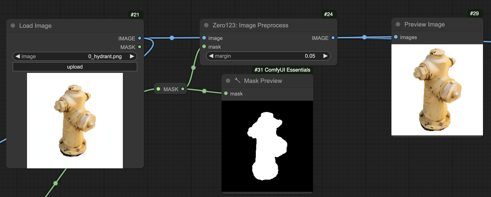

# ComfyUI Node for Zero-1-to-3: Zero-shot One Image to 3D Object

[中文](README_CN.md)

This is an unofficial porting of [Zero123 https://zero123.cs.columbia.edu/](https://zero123.cs.columbia.edu/) for ComfyUI, Zero123 is a framework for changing the camera viewpoint of an object given just a single RGB image.

This porting enable you generate 3D rotated image in ComfyUI.


# Quickly Start

After install this node, download the [sample workflow](sample/simple_workflow.json) to start trying.

If you have any questions or suggestions, please don't hesitate to leave them in the [issue tracker](https://github.com/kealiu/ComfyUI-Zero123-Porting/issues).

## Node and Workflow

### Node `Zero123: Image Rotate in 3D`


### Node `Zero123: Image Preprocess`



## PREREQUISITES

- INPUT `image` must `square` (width=height), otherwise, this node will automatically trans it forcely.
- INPUT `image` should be an `object` with **white background**, which means you need preprocess of image (use `Zero123: Image Preprocess).
- OUTPUT `image` only support `256x256` (fixed) currently, you can upscale it later.

# Explains

## Node `Zero123: Image Rotate in 3D` Input and Output

### INPUT

- **_image_** : input image, should be an `square` image, and an `object` with `white backgroup`.
- **_polar_angle_** : angle of `x` axis, turn up or down
    - `<0.0`: turn up
    - `>0.0`: turn down
- **_azimuth_angle_** : angle of `y` axis, turn left or right
    - `<0.0`: turn left
    - `>0.0`: turn right
- **_scale_** : `z` axis, `far away` or `near`;  
    - `>1.0` : means bigger, or `near`;
    - `0<1<1.0` : means smaller, or `far away`
    - `1.0` : mean no change
- **_steps_** : `75` is the default value by original `zero123` repo, do not smaller then `75`.
- **_batch_size_** : how many images you do like to generated. 
- **_fp16_** : whether to load model in `fp16`. enable it can speed up and save GPU mem.
- **_checkpoint_** : the model you select, `zero123-xl` is the lates one, and `stable-zero123`claim to be the best, but licences required for commercially use.
- **_height_** : output height, fix to 256, information only
- **_width_** : output width, fix to 256, information only
- **_sampler_** : cannot change, information only
- **_scheduler_** : cannot change, information only

### OUTPUT

- **_images_** : the output images

## Node `Zero123: Image Preprocess` Input and Output

### INPUT

- **_image_** : the original input `image`.
- **_mask_** : the `mask` of the `image`.
- **_margin_** : the `percentage(%)` margin of output image. 

### OUTPUT

- **_image_** : the processed `white background`, and `square` version input `image` with subject in center.

## Tips

- for proprecess image, segment out the subject, and remove all backgroup.
- use image corp to focus the main subject, and make a squre image
- try multi images and select the best one
- upscale for final usage.

# Installation

## By ComfyUI Manager

### Customer Nodes 

search `zero123` and select this repo, install it.

### Models

search `zero123` and install the model you like, such as `zero123-xl.ckpt` and `stable-zero123` (licences required for commercially).

## Manually Installation

### Customer Nodes 

```
cd ComfyUI/custom_nodes
git clone https://github.com/kealiu/ComfyUI-Zero123-Porting.git
cd ComfyUI-Zero123-Porting
pip install -r requirements.txt
```

And then, restart `ComfyUI`, and refresh your browser.

### Models

check out [`model-list.json`](model-list.json) for modules download URL, their should be place under **`ComfyUI/models/checkpoints/zero123/`**


# Zero123 related works

- `zero123` by [zero123](https://zero123.cs.columbia.edu/), the original one. This repo porting from this one.
- `stable-zero123` by [StableAI](https://stability.ai/), which train [models](https://huggingface.co/stabilityai/stable-zero123) with more data and claim to have better output.
- `zero123++` by [Sudo AI](https://sudo.ai), which [opensource a model](https://github.com/SUDO-AI-3D/zero123plus) that always gen image with fix angles.

# Thanks to

[Zero-1-to-3: Zero-shot One Image to 3D Object](https://github.com/cvlab-columbia/zero123),  which be able to learn control mechanisms that manipulate the camera viewpoint in large-scale diffusion models

```
@misc{liu2023zero1to3,
      title={Zero-1-to-3: Zero-shot One Image to 3D Object}, 
      author={Ruoshi Liu and Rundi Wu and Basile Van Hoorick and Pavel Tokmakov and Sergey Zakharov and Carl Vondrick},
      year={2023},
      eprint={2303.11328},
      archivePrefix={arXiv},
      primaryClass={cs.CV}
}
```
